# 避风港跨境合规智能体平台 - 页面结构图与交互流程图

**相关文档**:
- [前端实现文档](implementation.md) — 技术栈、架构、API通信等实现规范
- [设计系统文档](design-system.md) — 颜色、字体、组件库等设计规范

## 目录

1. [全局路由与页面结构图](#1-全局路由与页面结构图)
2. [布局结构图](#2-布局结构图)
3. [登录认证流程图](#3-登录认证流程图)
4. [SSE流式聊天交互时序图](#4-sse流式聊天交互时序图)
5. [知识库上传流程](#5-知识库上传流程)
6. [会话状态流转图](#6-会话状态流转图)
7. [合规检查交互流程](#7-合规检查交互流程)
8. [OAuth集成流程](#8-oauth集成流程)
9. [订单管理流程](#9-订单管理流程)
10. [订单状态流转图](#10-订单状态流转图)
11. [物流追踪流程](#11-物流追踪流程)
12. [物流状态流转图](#12-物流状态流转图)

---

## 1. 全局路由与页面结构图

```mermaid
flowchart TD
    subgraph 公开页面
        A[/\] --> LandingPage[LandingPage\n首页营销页]
        B[/login] --> Redirect1[重定向] --> C[/auth/login]
        D[/register] --> Redirect2[重定向] --> E[/auth/signup]
    end

    subgraph 认证页面 [AuthLayout]
        C --> LoginPage[LoginPage\n登录页]
        E --> RegisterPage[RegisterPage\n注册页]
    end

    subgraph 主应用 [AppLayout + RequireAuth]
        F[/app] --> G[/app/dashboard]
        G --> Dashboard[Dashboard\n仪表盘]
        
        H[/app/chat] --> ChatPage[ChatPage\n智能对话]
        I[/app/products] --> ProductCompliance[ProductCompliancePage\n产品合规]
        J[/app/products/:id/chat] --> ChatPage
        
        K[/app/compliance] --> CompliancePage[CompliancePage\n合规检查]
        L[/app/compliance/system] --> SystemCompliance[SystemCompliancePage\n系统合规]
        
        M[/app/knowledge] --> KnowledgePage[KnowledgePage\n知识库管理]
        N[/app/monitor] --> RiskCenter[RiskCenter\n风险监控]
        O[/app/risk-center] --> Redirect3[重定向] --> N
        
        P[/app/settings/profile] --> SettingsPage[SettingsPage\n个人设置]
        Q[/app/news-monitor] --> NewsMonitor[NewsMonitorPage\n新闻监控]
        R[/app/notify-config] --> NotifyConfig[NotifyConfigPage\n通知配置]
        S[/app/orders] --> OrdersPage[OrdersPage\n订单管理]
        T[/app/logistics] --> LogisticsTracking[LogisticsTrackingPage\n物流追踪]
        U[/app/nl-store] --> NLStorePage[NLStorePage\n自然语言存储]
        
        subgraph 管理员页面 [RequireAdmin]
            V[/app/agent-config] --> AgentConfig[AgentConfigPage\nAgent配置]
            W[/app/model-config] --> ModelConfig[ModelConfigPage\n模型配置]
            X[/app/integrations] --> IntegrationPage[IntegrationPage\n集成管理]
            Y[/app/scheduler] --> SchedulerConfig[SchedulerConfigPage\n定时任务]
            Z[/app/user-manage] --> UserManage[UserManagePage\n用户管理]
        end
    end

    subgraph 回调页面
        AA[/shopify/callback] --> ShopifyCallback[ShopifyCallbackPage\nShopify回调]
    end

    subgraph 错误处理
        BB[/*] --> NotFound[NotFoundPage\n404页面]
    end

    style A fill:#EFF1F3,stroke:#2463EB,stroke-width:2px
    style F fill:#EFF1F3,stroke:#2463EB,stroke-width:2px
    style 管理员页面 fill:#FCFCFC,stroke:#F59E0B,stroke-width:2px
```

---

## 2. 布局结构图

### 2.1 AppLayout 布局结构

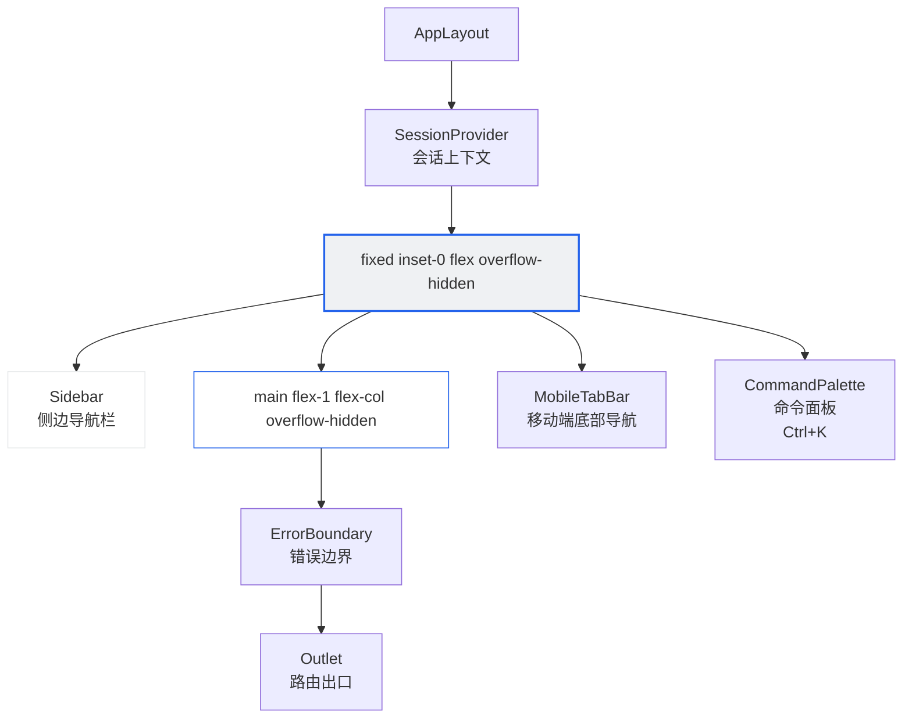
```mermaid
flowchart TB
    AppLayout[AppLayout] --> SessionProvider[SessionProvider\n会话上下文]
    SessionProvider --> Container[fixed inset-0 flex overflow-hidden]
    
    Container --> Sidebar[Sidebar\n侧边导航栏]
    Container --> Main[main flex-1 flex-col overflow-hidden]
    
    Main --> ErrorBoundary[ErrorBoundary\n错误边界]
    ErrorBoundary --> Outlet[Outlet\n路由出口]
    
    Container --> MobileTabBar[MobileTabBar\n移动端底部导航]
    Container --> CommandPalette[CommandPalette\n命令面板\nCtrl+K]

    style Container fill:#EFF1F3,stroke:#2463EB,stroke-width:2px
    style Main fill:#FFFFFF,stroke:#2463EB,stroke-width:1px
    style Sidebar fill:#FFFFFF,stroke:#E8EAEB,stroke-width:1px
```

### 2.2 AuthLayout 布局结构

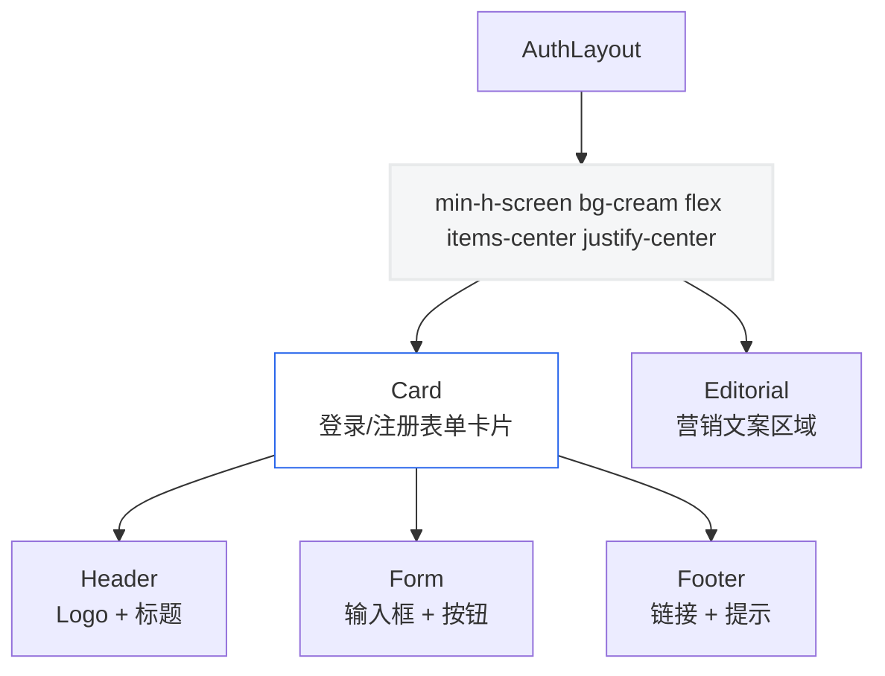
```mermaid
flowchart TB
    AuthLayout[AuthLayout] --> AuthContainer[min-h-screen bg-cream flex items-center justify-center]
    
    AuthContainer --> Card[Card\n登录/注册表单卡片]
    Card --> Header[Header\nLogo + 标题]
    Card --> Form[Form\n输入框 + 按钮]
    Card --> Footer[Footer\n链接 + 提示]
    
    AuthContainer --> Editorial[Editorial\n营销文案区域]

    style AuthContainer fill:#F5F6F7,stroke:#E8EAEB,stroke-width:2px
    style Card fill:#FFFFFF,stroke:#2463EB,stroke-width:1px
```

### 2.3 ChatPage 页面结构

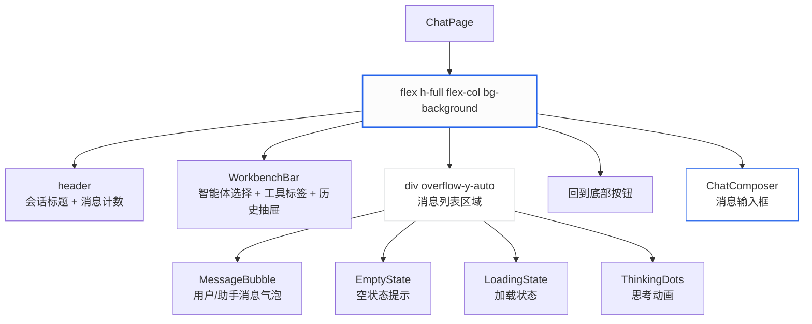
```mermaid
flowchart TB
    ChatPage[ChatPage] --> ChatContainer[flex h-full flex-col bg-background]
    
    ChatContainer --> Header[header\n会话标题 + 消息计数]
    ChatContainer --> WorkbenchBar[WorkbenchBar\n智能体选择 + 工具标签 + 历史抽屉]
    ChatContainer --> ScrollArea[div overflow-y-auto\n消息列表区域]
    
    ScrollArea --> MessageList[MessageBubble\n用户/助手消息气泡]
    ScrollArea --> EmptyState[EmptyState\n空状态提示]
    ScrollArea --> LoadingState[LoadingState\n加载状态]
    ScrollArea --> ThinkingDots[ThinkingDots\n思考动画]
    
    ChatContainer --> FollowButton[回到底部按钮]
    ChatContainer --> ChatComposer[ChatComposer\n消息输入框]

    style ChatContainer fill:#FCFCFC,stroke:#2463EB,stroke-width:2px
    style ScrollArea fill:#FFFFFF,stroke:#E8EAEB,stroke-width:1px
    style ChatComposer fill:#FFFFFF,stroke:#2463EB,stroke-width:1px
```

---

## 3. 登录认证流程图

### 3.1 用户登录时序

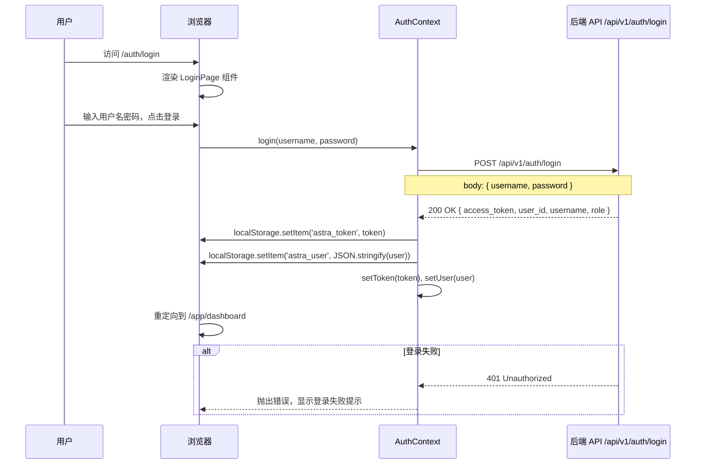
```mermaid
sequenceDiagram
    participant User as 用户
    participant Browser as 浏览器
    participant AuthContext as AuthContext
    participant API as 后端 API /api/v1/auth/login

    User->>Browser: 访问 /auth/login
    Browser->>Browser: 渲染 LoginPage 组件
    
    User->>Browser: 输入用户名密码，点击登录
    Browser->>AuthContext: login(username, password)
    
    AuthContext->>API: POST /api/v1/auth/login
    Note over AuthContext,API: body: { username, password }
    
    API-->>AuthContext: 200 OK { access_token, user_id, username, role }
    AuthContext->>Browser: localStorage.setItem('astra_token', token)
    AuthContext->>Browser: localStorage.setItem('astra_user', JSON.stringify(user))
    AuthContext->>AuthContext: setToken(token), setUser(user)
    
    Browser->>Browser: 重定向到 /app/dashboard

    alt 登录失败
        API-->>AuthContext: 401 Unauthorized
        AuthContext-->>Browser: 抛出错误，显示登录失败提示
    end
```

### 3.2 页面刷新认证恢复

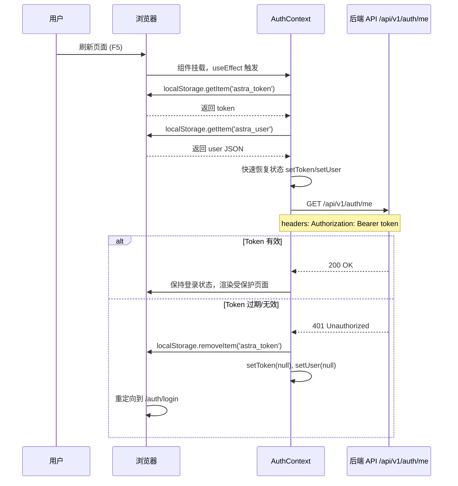
```mermaid
sequenceDiagram
    participant User as 用户
    participant Browser as 浏览器
    participant AuthContext as AuthContext
    participant API as 后端 API /api/v1/auth/me

    User->>Browser: 刷新页面 (F5)
    
    Browser->>AuthContext: 组件挂载，useEffect 触发
    
    AuthContext->>Browser: localStorage.getItem('astra_token')
    Browser-->>AuthContext: 返回 token
    
    AuthContext->>Browser: localStorage.getItem('astra_user')
    Browser-->>AuthContext: 返回 user JSON
    
    AuthContext->>AuthContext: 快速恢复状态 setToken/setUser
    
    AuthContext->>API: GET /api/v1/auth/me
    Note over AuthContext,API: headers: Authorization: Bearer token
    
    alt Token 有效
        API-->>AuthContext: 200 OK
        AuthContext->>Browser: 保持登录状态，渲染受保护页面
    else Token 过期/无效
        API-->>AuthContext: 401 Unauthorized
        AuthContext->>Browser: localStorage.removeItem('astra_token')
        AuthContext->>AuthContext: setToken(null), setUser(null)
        Browser->>Browser: 重定向到 /auth/login
    end
```

---

## 4. SSE流式聊天交互时序图

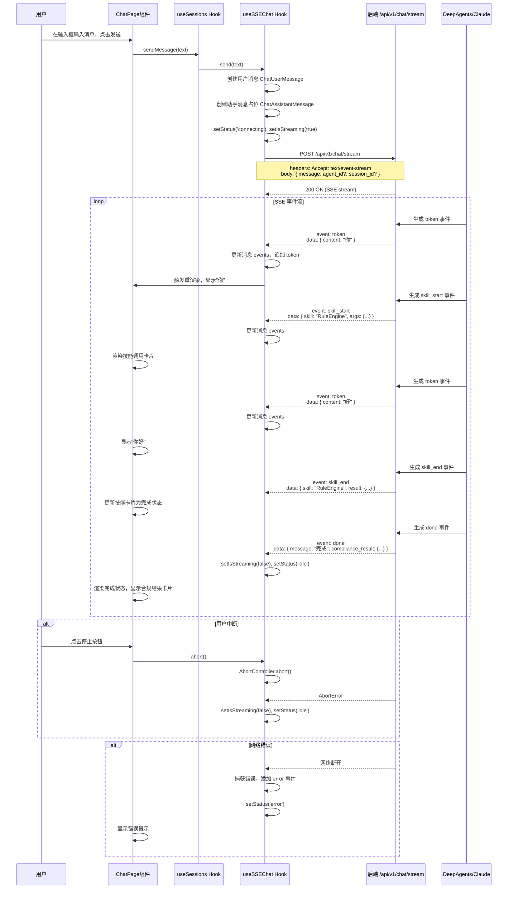
```mermaid
sequenceDiagram
    participant User as 用户
    participant ChatPage as ChatPage组件
    participant useSessions as useSessions Hook
    participant useSSEChat as useSSEChat Hook
    participant API as 后端 /api/v1/chat/stream
    participant Agent as DeepAgents/Claude

    User->>ChatPage: 在输入框输入消息，点击发送
    ChatPage->>useSessions: sendMessage(text)
    
    useSessions->>useSSEChat: send(text)
    
    useSSEChat->>useSSEChat: 创建用户消息 ChatUserMessage
    useSSEChat->>useSSEChat: 创建助手消息占位 ChatAssistantMessage
    useSSEChat->>useSSEChat: setStatus('connecting'), setIsStreaming(true)
    
    useSSEChat->>API: POST /api/v1/chat/stream
    Note over useSSEChat,API: headers: Accept: text/event-stream<br/>body: { message, agent_id?, session_id? }
    
    API-->>useSSEChat: 200 OK (SSE stream)
    
    loop SSE 事件流
        Agent->>API: 生成 token 事件
        API-->>useSSEChat: event: token<br/>data: { content: "你" }
        useSSEChat->>useSSEChat: 更新消息 events，追加 token
        useSSEChat->>ChatPage: 触发重渲染，显示"你"
        
        Agent->>API: 生成 skill_start 事件
        API-->>useSSEChat: event: skill_start<br/>data: { skill: "RuleEngine", args: {...} }
        useSSEChat->>useSSEChat: 更新消息 events
        ChatPage->>ChatPage: 渲染技能调用卡片
        
        Agent->>API: 生成 token 事件
        API-->>useSSEChat: event: token<br/>data: { content: "好" }
        useSSEChat->>useSSEChat: 更新消息 events
        ChatPage->>ChatPage: 显示"你好"
        
        Agent->>API: 生成 skill_end 事件
        API-->>useSSEChat: event: skill_end<br/>data: { skill: "RuleEngine", result: {...} }
        ChatPage->>ChatPage: 更新技能卡片为完成状态
        
        Agent->>API: 生成 done 事件
        API-->>useSSEChat: event: done<br/>data: { message: "完成", compliance_result: {...} }
        useSSEChat->>useSSEChat: setIsStreaming(false), setStatus('idle')
        ChatPage->>ChatPage: 渲染完成状态，显示合规结果卡片
    end

    alt 用户中断
        User->>ChatPage: 点击停止按钮
        ChatPage->>useSSEChat: abort()
        useSSEChat->>useSSEChat: AbortController.abort()
        API-->>useSSEChat: AbortError
        useSSEChat->>useSSEChat: setIsStreaming(false), setStatus('idle')
    end

    alt 网络错误
        API-->>useSSEChat: 网络断开
        useSSEChat->>useSSEChat: 捕获错误，添加 error 事件
        useSSEChat->>useSSEChat: setStatus('error')
        ChatPage->>ChatPage: 显示错误提示
    end
```

---

## 5. 知识库上传流程

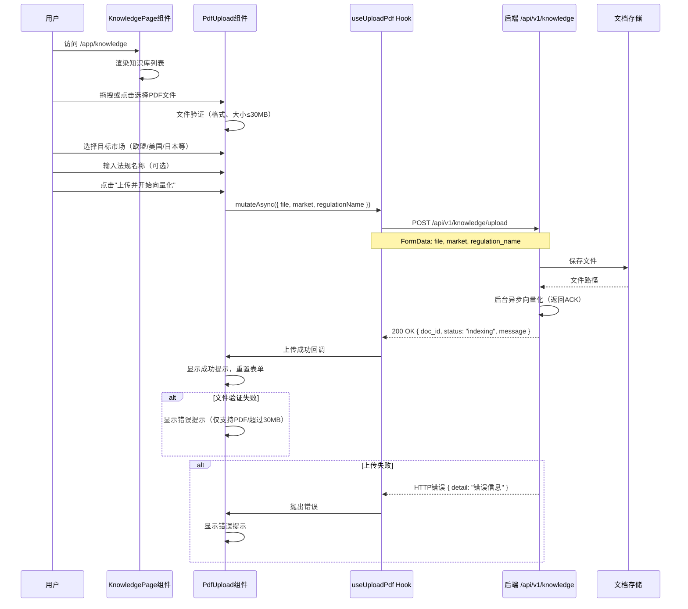
```mermaid
sequenceDiagram
    participant User as 用户
    participant KnowledgePage as KnowledgePage组件
    participant PdfUpload as PdfUpload组件
    participant useUploadPdf as useUploadPdf Hook
    participant API as 后端 /api/v1/knowledge
    participant Storage as 文档存储
    
    User->>KnowledgePage: 访问 /app/knowledge
    KnowledgePage->>KnowledgePage: 渲染知识库列表
    
    User->>PdfUpload: 拖拽或点击选择PDF文件
    PdfUpload->>PdfUpload: 文件验证（格式、大小≤30MB）
    
    User->>PdfUpload: 选择目标市场（欧盟/美国/日本等）
    User->>PdfUpload: 输入法规名称（可选）
    
    User->>PdfUpload: 点击"上传并开始向量化"
    PdfUpload->>useUploadPdf: mutateAsync({ file, market, regulationName })
    
    useUploadPdf->>API: POST /api/v1/knowledge/upload
    Note over useUploadPdf,API: FormData: file, market, regulation_name
    
    API->>Storage: 保存文件
    Storage-->>API: 文件路径
    
    API->>API: 后台异步向量化（返回ACK）
    API-->>useUploadPdf: 200 OK { doc_id, status: "indexing", message }
    
    useUploadPdf->>PdfUpload: 上传成功回调
    PdfUpload->>PdfUpload: 显示成功提示，重置表单
    
    alt 文件验证失败
        PdfUpload->>PdfUpload: 显示错误提示（仅支持PDF/超过30MB）
    end
    
    alt 上传失败
        API-->>useUploadPdf: HTTP错误 { detail: "错误信息" }
        useUploadPdf->>PdfUpload: 抛出错误
        PdfUpload->>PdfUpload: 显示错误提示
    end
```

---

## 6. 会话状态流转图

### 6.1 会话生命周期

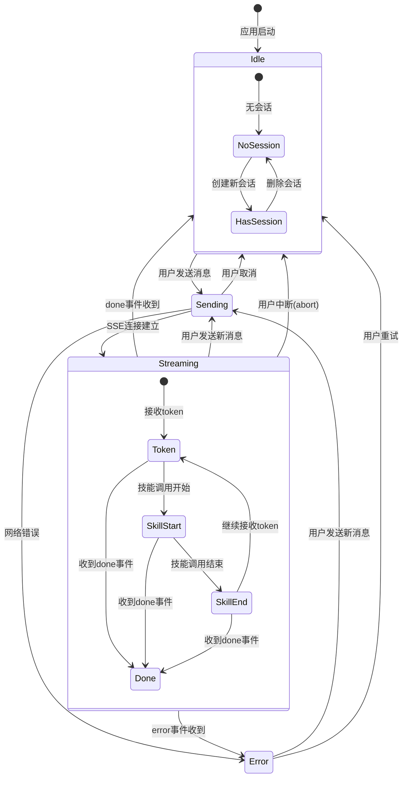
```mermaid
stateDiagram-v2
    [*] --> Idle: 应用启动
    
    state Idle {
        [*] --> NoSession: 无会话
        NoSession --> HasSession: 创建新会话
        HasSession --> NoSession: 删除会话
    }
    
    Idle --> Sending: 用户发送消息
    Sending --> Streaming: SSE连接建立
    Sending --> Error: 网络错误
    Sending --> Idle: 用户取消
    
    Streaming --> Idle: done事件收到
    Streaming --> Error: error事件收到
    Streaming --> Sending: 用户发送新消息
    Streaming --> Idle: 用户中断(abort)
    
    Error --> Idle: 用户重试
    Error --> Sending: 用户发送新消息
    
    state Streaming {
        [*] --> Token: 接收token
        Token --> SkillStart: 技能调用开始
        SkillStart --> SkillEnd: 技能调用结束
        SkillEnd --> Token: 继续接收token
        Token --> Done: 收到done事件
        SkillStart --> Done: 收到done事件
        SkillEnd --> Done: 收到done事件
    }
```

### 6.2 SSE连接状态机

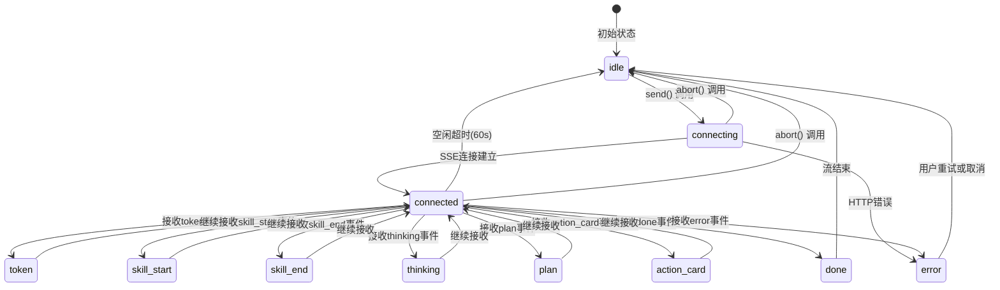
```mermaid
stateDiagram-v2
    [*] --> idle: 初始状态
    
    idle --> connecting: send() 调用
    connecting --> connected: SSE连接建立
    connecting --> error: HTTP错误
    connecting --> idle: abort() 调用
    
    connected --> token: 接收token事件
    connected --> skill_start: 接收skill_start事件
    connected --> skill_end: 接收skill_end事件
    connected --> thinking: 接收thinking事件
    connected --> plan: 接收plan事件
    connected --> action_card: 接收action_card事件
    connected --> done: 接收done事件
    connected --> error: 接收error事件
    connected --> idle: 空闲超时(60s)
    connected --> idle: abort() 调用
    
    token --> connected: 继续接收
    skill_start --> connected: 继续接收
    skill_end --> connected: 继续接收
    thinking --> connected: 继续接收
    plan --> connected: 继续接收
    action_card --> connected: 继续接收
    
    done --> idle: 流结束
    error --> idle: 用户重试或取消
```

---

## 7. 合规检查交互流程

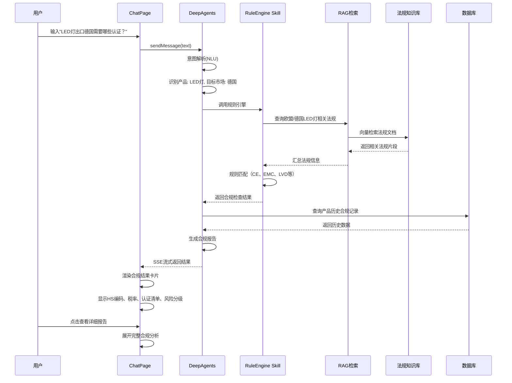
```mermaid
sequenceDiagram
    participant User as 用户
    participant ChatPage as ChatPage
    participant Agent as DeepAgents
    participant RuleEngine as RuleEngine Skill
    participant RAG as RAG检索
    participant KB as 法规知识库
    participant DB as 数据库

    User->>ChatPage: 输入"LED灯出口德国需要哪些认证？"
    ChatPage->>Agent: sendMessage(text)
    
    Agent->>Agent: 意图解析(NLU)
    Agent->>Agent: 识别产品: LED灯, 目标市场: 德国
    
    Agent->>RuleEngine: 调用规则引擎
    RuleEngine->>RAG: 查询欧盟/德国LED灯相关法规
    RAG->>KB: 向量检索法规文档
    KB-->>RAG: 返回相关法规片段
    RAG-->>RuleEngine: 汇总法规信息
    
    RuleEngine->>RuleEngine: 规则匹配（CE、EMC、LVD等）
    RuleEngine-->>Agent: 返回合规检查结果
    
    Agent->>DB: 查询产品历史合规记录
    DB-->>Agent: 返回历史数据
    
    Agent->>Agent: 生成合规报告
    Agent-->>ChatPage: SSE流式返回结果
    
    ChatPage->>ChatPage: 渲染合规结果卡片
    ChatPage->>ChatPage: 显示HS编码、税率、认证清单、风险分级
    
    User->>ChatPage: 点击查看详细报告
    ChatPage->>ChatPage: 展开完整合规分析
```

---

## 8. OAuth集成流程（以Shopify为例）

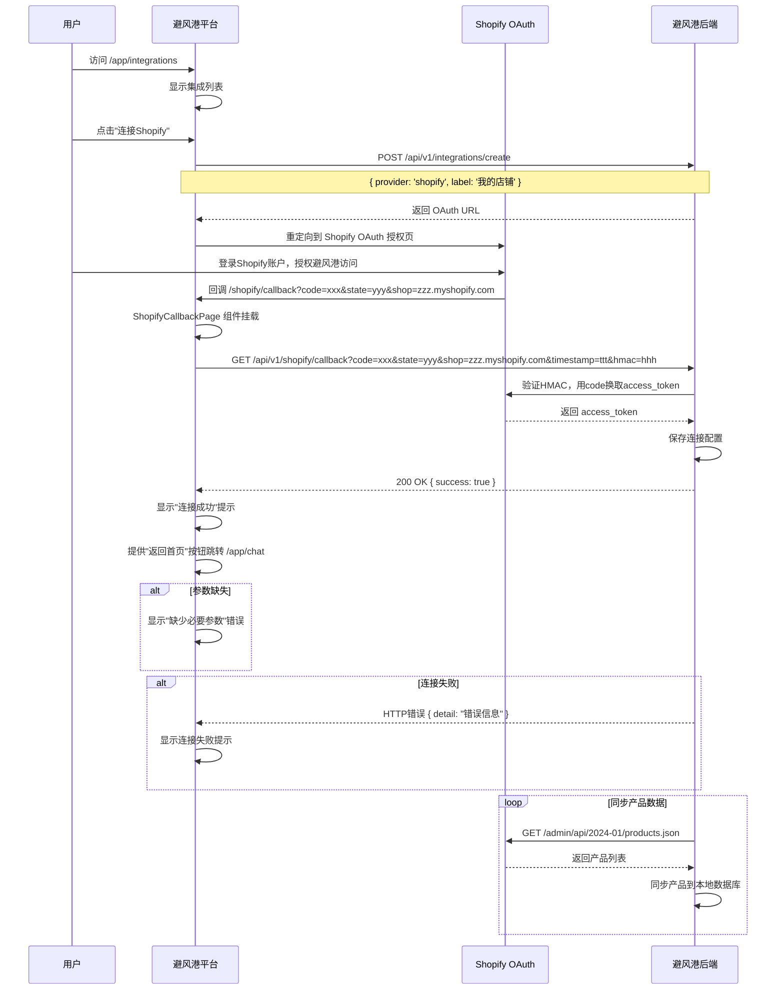
```mermaid
sequenceDiagram
    participant User as 用户
    participant Platform as 避风港平台
    participant Shopify as Shopify OAuth
    participant API as 避风港后端

    User->>Platform: 访问 /app/integrations
    Platform->>Platform: 显示集成列表
    
    User->>Platform: 点击"连接Shopify"
    Platform->>API: POST /api/v1/integrations/create
    Note over Platform,API: { provider: 'shopify', label: '我的店铺' }
    
    API-->>Platform: 返回 OAuth URL
    Platform->>Shopify: 重定向到 Shopify OAuth 授权页
    
    User->>Shopify: 登录Shopify账户，授权避风港访问
    
    Shopify->>Platform: 回调 /shopify/callback?code=xxx&state=yyy&shop=zzz.myshopify.com
    
    Platform->>Platform: ShopifyCallbackPage 组件挂载
    Platform->>API: GET /api/v1/shopify/callback?code=xxx&state=yyy&shop=zzz.myshopify.com&timestamp=ttt&hmac=hhh
    
    API->>Shopify: 验证HMAC，用code换取access_token
    Shopify-->>API: 返回 access_token
    
    API->>API: 保存连接配置
    API-->>Platform: 200 OK { success: true }
    
    Platform->>Platform: 显示"连接成功"提示
    Platform->>Platform: 提供"返回首页"按钮跳转 /app/chat

    alt 参数缺失
        Platform->>Platform: 显示"缺少必要参数"错误
    end
    
    alt 连接失败
        API-->>Platform: HTTP错误 { detail: "错误信息" }
        Platform->>Platform: 显示连接失败提示
    end

    loop 同步产品数据
        API->>Shopify: GET /admin/api/2024-01/products.json
        Shopify-->>API: 返回产品列表
        API->>API: 同步产品到本地数据库
    end
```

---

## 9. 订单管理流程

### 9.1 订单列表加载与筛选

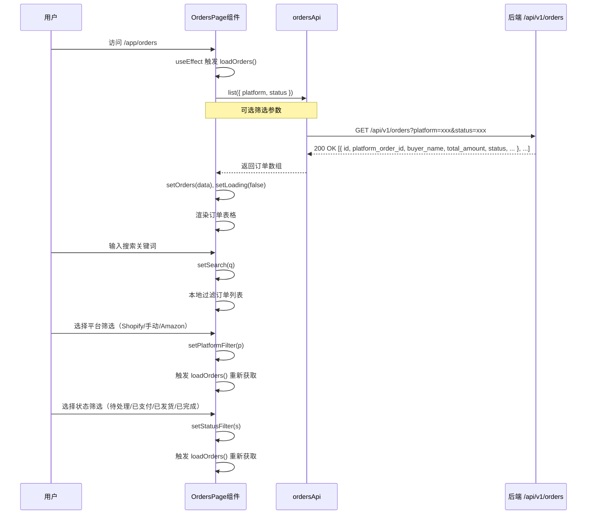
```mermaid
sequenceDiagram
    participant User as 用户
    participant OrdersPage as OrdersPage组件
    participant ordersApi as ordersApi
    participant API as 后端 /api/v1/orders

    User->>OrdersPage: 访问 /app/orders
    OrdersPage->>OrdersPage: useEffect 触发 loadOrders()
    
    OrdersPage->>ordersApi: list({ platform, status })
    Note over OrdersPage,ordersApi: 可选筛选参数
    
    ordersApi->>API: GET /api/v1/orders?platform=xxx&status=xxx
    API-->>ordersApi: 200 OK [{ id, platform_order_id, buyer_name, total_amount, status, ... }, ...]
    
    ordersApi-->>OrdersPage: 返回订单数组
    OrdersPage->>OrdersPage: setOrders(data), setLoading(false)
    OrdersPage->>OrdersPage: 渲染订单表格
    
    User->>OrdersPage: 输入搜索关键词
    OrdersPage->>OrdersPage: setSearch(q)
    OrdersPage->>OrdersPage: 本地过滤订单列表
    
    User->>OrdersPage: 选择平台筛选（Shopify/手动/Amazon）
    OrdersPage->>OrdersPage: setPlatformFilter(p)
    OrdersPage->>OrdersPage: 触发 loadOrders() 重新获取
    
    User->>OrdersPage: 选择状态筛选（待处理/已支付/已发货/已完成）
    OrdersPage->>OrdersPage: setStatusFilter(s)
    OrdersPage->>OrdersPage: 触发 loadOrders() 重新获取
```

### 9.2 新建订单流程

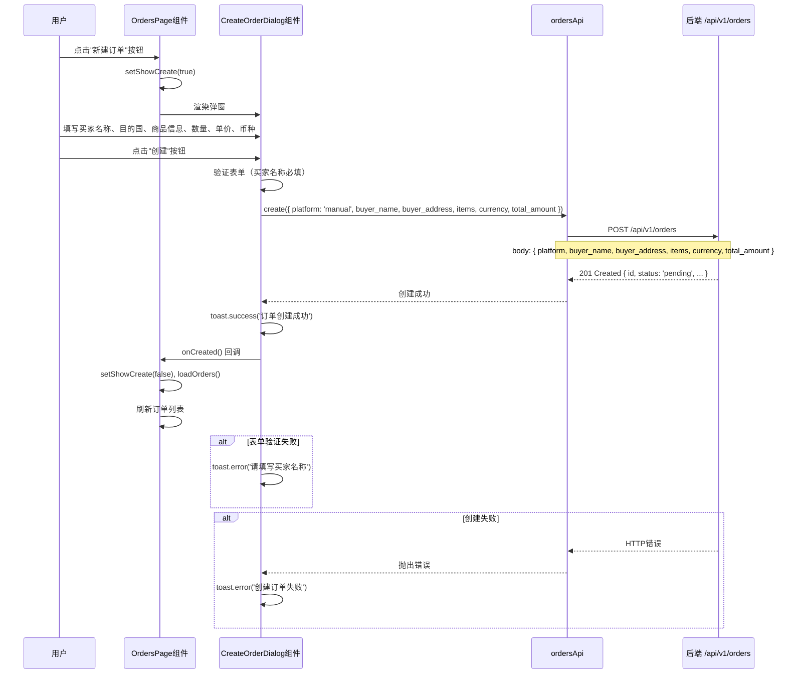
```mermaid
sequenceDiagram
    participant User as 用户
    participant OrdersPage as OrdersPage组件
    participant CreateOrderDialog as CreateOrderDialog组件
    participant ordersApi as ordersApi
    participant API as 后端 /api/v1/orders

    User->>OrdersPage: 点击"新建订单"按钮
    OrdersPage->>OrdersPage: setShowCreate(true)
    
    OrdersPage->>CreateOrderDialog: 渲染弹窗
    
    User->>CreateOrderDialog: 填写买家名称、目的国、商品信息、数量、单价、币种
    
    User->>CreateOrderDialog: 点击"创建"按钮
    CreateOrderDialog->>CreateOrderDialog: 验证表单（买家名称必填）
    CreateOrderDialog->>ordersApi: create({ platform: 'manual', buyer_name, buyer_address, items, currency, total_amount })
    
    ordersApi->>API: POST /api/v1/orders
    Note over ordersApi,API: body: { platform, buyer_name, buyer_address, items, currency, total_amount }
    
    API-->>ordersApi: 201 Created { id, status: 'pending', ... }
    ordersApi-->>CreateOrderDialog: 创建成功
    CreateOrderDialog->>CreateOrderDialog: toast.success('订单创建成功')
    CreateOrderDialog->>OrdersPage: onCreated() 回调
    OrdersPage->>OrdersPage: setShowCreate(false), loadOrders()
    OrdersPage->>OrdersPage: 刷新订单列表

    alt 表单验证失败
        CreateOrderDialog->>CreateOrderDialog: toast.error('请填写买家名称')
    end
    
    alt 创建失败
        API-->>ordersApi: HTTP错误
        ordersApi-->>CreateOrderDialog: 抛出错误
        CreateOrderDialog->>CreateOrderDialog: toast.error('创建订单失败')
    end
```

### 9.3 订单详情与支付记录

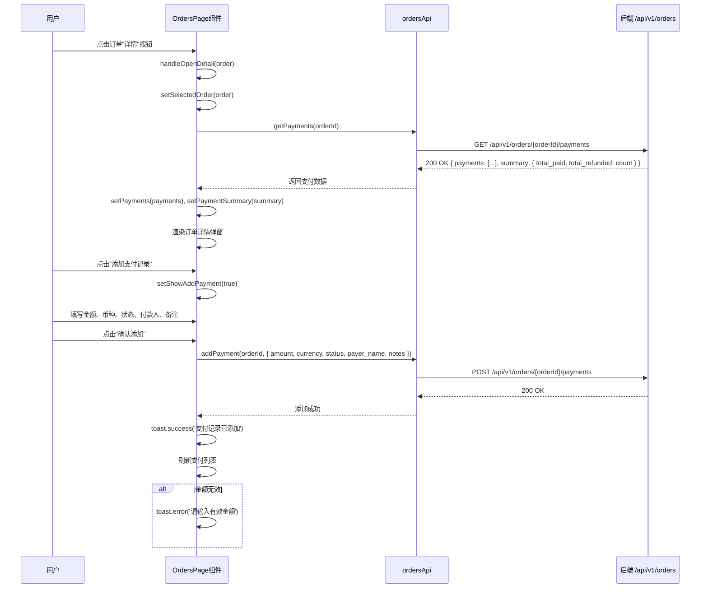
```mermaid
sequenceDiagram
    participant User as 用户
    participant OrdersPage as OrdersPage组件
    participant ordersApi as ordersApi
    participant API as 后端 /api/v1/orders

    User->>OrdersPage: 点击订单"详情"按钮
    OrdersPage->>OrdersPage: handleOpenDetail(order)
    OrdersPage->>OrdersPage: setSelectedOrder(order)
    OrdersPage->>ordersApi: getPayments(orderId)
    
    ordersApi->>API: GET /api/v1/orders/{orderId}/payments
    API-->>ordersApi: 200 OK { payments: [...], summary: { total_paid, total_refunded, count } }
    
    ordersApi-->>OrdersPage: 返回支付数据
    OrdersPage->>OrdersPage: setPayments(payments), setPaymentSummary(summary)
    OrdersPage->>OrdersPage: 渲染订单详情弹窗
    
    User->>OrdersPage: 点击"添加支付记录"
    OrdersPage->>OrdersPage: setShowAddPayment(true)
    
    User->>OrdersPage: 填写金额、币种、状态、付款人、备注
    User->>OrdersPage: 点击"确认添加"
    OrdersPage->>ordersApi: addPayment(orderId, { amount, currency, status, payer_name, notes })
    
    ordersApi->>API: POST /api/v1/orders/{orderId}/payments
    API-->>ordersApi: 200 OK
    ordersApi-->>OrdersPage: 添加成功
    OrdersPage->>OrdersPage: toast.success('支付记录已添加')
    OrdersPage->>OrdersPage: 刷新支付列表

    alt 金额无效
        OrdersPage->>OrdersPage: toast.error('请输入有效金额')
    end
```

### 9.4 三单一致性检查

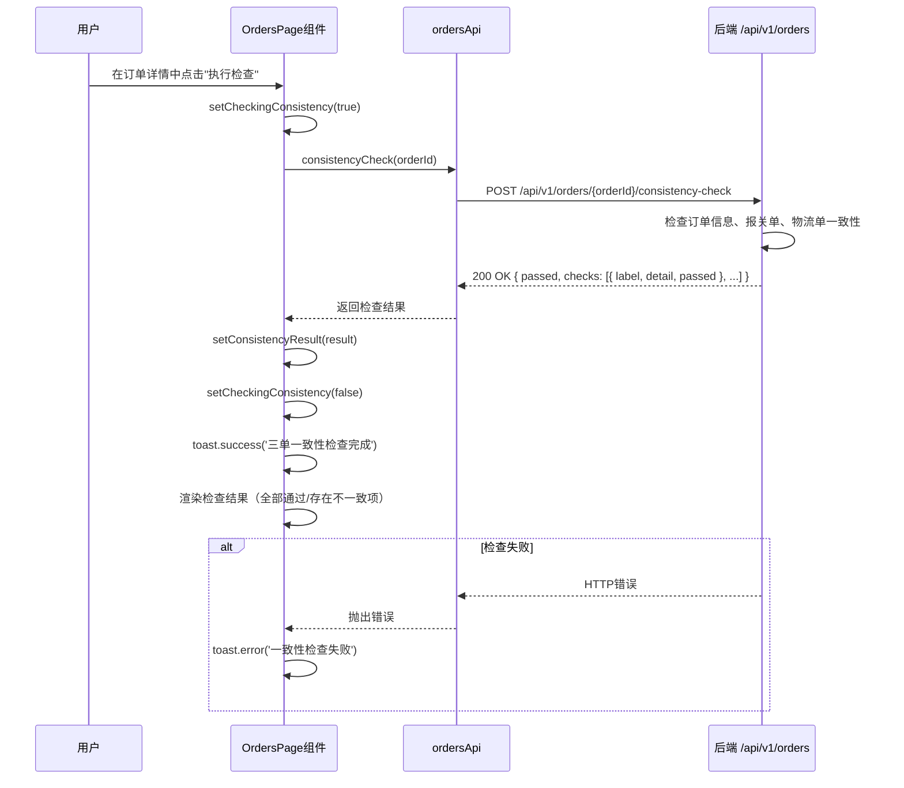
```mermaid
sequenceDiagram
    participant User as 用户
    participant OrdersPage as OrdersPage组件
    participant ordersApi as ordersApi
    participant API as 后端 /api/v1/orders

    User->>OrdersPage: 在订单详情中点击"执行检查"
    OrdersPage->>OrdersPage: setCheckingConsistency(true)
    OrdersPage->>ordersApi: consistencyCheck(orderId)
    
    ordersApi->>API: POST /api/v1/orders/{orderId}/consistency-check
    API->>API: 检查订单信息、报关单、物流单一致性
    API-->>ordersApi: 200 OK { passed, checks: [{ label, detail, passed }, ...] }
    
    ordersApi-->>OrdersPage: 返回检查结果
    OrdersPage->>OrdersPage: setConsistencyResult(result)
    OrdersPage->>OrdersPage: setCheckingConsistency(false)
    OrdersPage->>OrdersPage: toast.success('三单一致性检查完成')
    OrdersPage->>OrdersPage: 渲染检查结果（全部通过/存在不一致项）

    alt 检查失败
        API-->>ordersApi: HTTP错误
        ordersApi-->>OrdersPage: 抛出错误
        OrdersPage->>OrdersPage: toast.error('一致性检查失败')
    end
```

---

## 10. 订单状态流转图

### 10.1 订单生命周期状态机

```mermaid
stateDiagram-v2
    [*] --> pending: 创建订单
    
    pending --> paid: 收到支付
    pending --> cancelled: 用户取消/超时
    
    paid --> fulfilled: 商家发货
    paid --> refunded: 全额退款
    
    fulfilled --> completed: 买家签收
    fulfilled --> returned: 买家退货
    fulfilled --> exception: 物流异常
    
    completed --> [*]: 订单结束
    
    cancelled --> [*]: 订单结束
    refunded --> [*]: 订单结束
    returned --> [*]: 订单结束
    exception --> fulfilled: 异常解决，继续运输
    exception --> returned: 异常无法解决，退回
    
    note right of pending
        待处理
        等待买家支付或商家确认
    end
    
    note right of paid
        已支付
        买家已完成支付
    end
    
    note right of fulfilled
        已发货
        商家已发货，等待运输
    end
    
    note right of completed
        已完成
        买家已签收，交易完成
    end
    
    note right of cancelled
        已取消
        订单已取消
    end
    
    note right of refunded
        已退款
        款项已退还买家
    end
    
    note right of returned
        已退回
        商品已退回商家
    end
```

### 10.2 订单状态配置

| 状态码 | 中文标签 | 样式颜色 | 说明 |
|--------|----------|----------|------|
| pending | 待处理 | amber-50 | 等待支付或确认 |
| paid | 已支付 | blue-50 | 买家已完成支付 |
| fulfilled | 已发货 | purple-50 | 商家已发货 |
| completed | 已完成 | emerald-50 | 买家已签收 |
| cancelled | 已取消 | rose-50 | 订单已取消 |
| refunded | 已退款 | gray-50 | 款项已退还 |

---

## 11. 物流追踪流程

### 11.1 物流查询流程

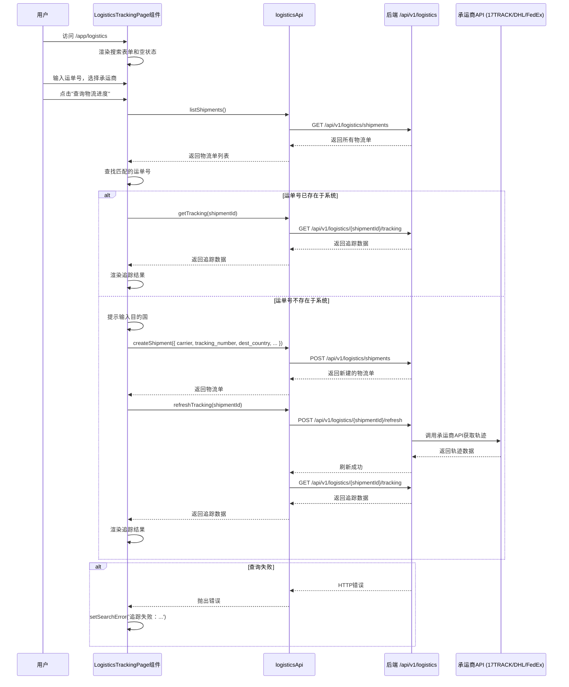
```mermaid
sequenceDiagram
    participant User as 用户
    participant LogisticsPage as LogisticsTrackingPage组件
    participant logisticsApi as logisticsApi
    participant API as 后端 /api/v1/logistics
    participant Carrier as 承运商API (17TRACK/DHL/FedEx)

    User->>LogisticsPage: 访问 /app/logistics
    LogisticsPage->>LogisticsPage: 渲染搜索表单和空状态
    
    User->>LogisticsPage: 输入运单号，选择承运商
    User->>LogisticsPage: 点击"查询物流进度"
    
    LogisticsPage->>logisticsApi: listShipments()
    logisticsApi->>API: GET /api/v1/logistics/shipments
    API-->>logisticsApi: 返回所有物流单
    
    logisticsApi-->>LogisticsPage: 返回物流单列表
    LogisticsPage->>LogisticsPage: 查找匹配的运单号
    
    alt 运单号已存在于系统
        LogisticsPage->>logisticsApi: getTracking(shipmentId)
        logisticsApi->>API: GET /api/v1/logistics/{shipmentId}/tracking
        API-->>logisticsApi: 返回追踪数据
        logisticsApi-->>LogisticsPage: 返回追踪数据
        LogisticsPage->>LogisticsPage: 渲染追踪结果
    else 运单号不存在于系统
        LogisticsPage->>LogisticsPage: 提示输入目的国
        LogisticsPage->>logisticsApi: createShipment({ carrier, tracking_number, dest_country, ... })
        logisticsApi->>API: POST /api/v1/logistics/shipments
        API-->>logisticsApi: 返回新建的物流单
        
        logisticsApi-->>LogisticsPage: 返回物流单
        LogisticsPage->>logisticsApi: refreshTracking(shipmentId)
        logisticsApi->>API: POST /api/v1/logistics/{shipmentId}/refresh
        
        API->>Carrier: 调用承运商API获取轨迹
        Carrier-->>API: 返回轨迹数据
        API-->>logisticsApi: 刷新成功
        
        logisticsApi->>API: GET /api/v1/logistics/{shipmentId}/tracking
        API-->>logisticsApi: 返回追踪数据
        logisticsApi-->>LogisticsPage: 返回追踪数据
        LogisticsPage->>LogisticsPage: 渲染追踪结果
    end
    
    alt 查询失败
        API-->>logisticsApi: HTTP错误
        logisticsApi-->>LogisticsPage: 抛出错误
        LogisticsPage->>LogisticsPage: setSearchError('追踪失败：...')
    end
```

### 11.2 WebSocket实时推送

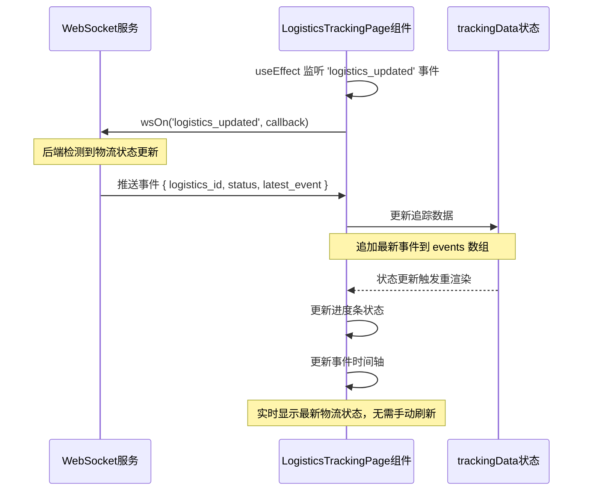
```mermaid
sequenceDiagram
    participant WS as WebSocket服务
    participant LogisticsPage as LogisticsTrackingPage组件
    participant trackingData as trackingData状态

    LogisticsPage->>LogisticsPage: useEffect 监听 'logistics_updated' 事件
    LogisticsPage->>WS: wsOn('logistics_updated', callback)
    
    Note over WS: 后端检测到物流状态更新
    
    WS->>LogisticsPage: 推送事件 { logistics_id, status, latest_event }
    
    LogisticsPage->>trackingData: 更新追踪数据
    Note over LogisticsPage,trackingData: 追加最新事件到 events 数组
    trackingData-->>LogisticsPage: 状态更新触发重渲染
    
    LogisticsPage->>LogisticsPage: 更新进度条状态
    LogisticsPage->>LogisticsPage: 更新事件时间轴
    
    Note over LogisticsPage: 实时显示最新物流状态，无需手动刷新
```

### 11.3 手动刷新轨迹

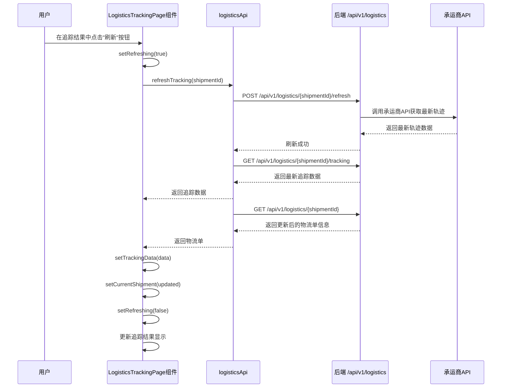
```mermaid
sequenceDiagram
    participant User as 用户
    participant LogisticsPage as LogisticsTrackingPage组件
    participant logisticsApi as logisticsApi
    participant API as 后端 /api/v1/logistics
    participant Carrier as 承运商API

    User->>LogisticsPage: 在追踪结果中点击"刷新"按钮
    LogisticsPage->>LogisticsPage: setRefreshing(true)
    
    LogisticsPage->>logisticsApi: refreshTracking(shipmentId)
    logisticsApi->>API: POST /api/v1/logistics/{shipmentId}/refresh
    
    API->>Carrier: 调用承运商API获取最新轨迹
    Carrier-->>API: 返回最新轨迹数据
    API-->>logisticsApi: 刷新成功
    
    logisticsApi->>API: GET /api/v1/logistics/{shipmentId}/tracking
    API-->>logisticsApi: 返回最新追踪数据
    logisticsApi-->>LogisticsPage: 返回追踪数据
    
    logisticsApi->>API: GET /api/v1/logistics/{shipmentId}
    API-->>logisticsApi: 返回更新后的物流单信息
    logisticsApi-->>LogisticsPage: 返回物流单
    
    LogisticsPage->>LogisticsPage: setTrackingData(data)
    LogisticsPage->>LogisticsPage: setCurrentShipment(updated)
    LogisticsPage->>LogisticsPage: setRefreshing(false)
    LogisticsPage->>LogisticsPage: 更新追踪结果显示
```

---

## 12. 物流状态流转图

### 12.1 物流阶段状态机

```mermaid
stateDiagram-v2
    [*] --> pending: 创建物流单
    
    pending --> picked_up: 承运商揽收
    
    picked_up --> in_transit: 进入运输
    
    in_transit --> customs_export: 到达出口海关
    
    customs_export --> customs_import: 到达进口海关
    
    customs_import --> out_for_delivery: 清关完成，开始派送
    
    out_for_delivery --> delivered: 买家签收
    
    delivered --> [*]: 物流结束
    
    note right of pending
        待揽收
        等待承运商上门取件
    end
    
    note right of picked_up
        已揽收
        承运商已收取包裹
    end
    
    note right of in_transit
        运输中
        包裹在途中运输
    end
    
    note right of customs_export
        出口报关中
        正在办理出口海关手续
    end
    
    note right of customs_import
        进口清关中
        正在办理进口海关手续
    end
    
    note right of out_for_delivery
        派送中
        快递员正在派送
    end
    
    note right of delivered
        已签收
        买家已签收包裹
    end
```

### 12.2 异常状态处理

```mermaid
stateDiagram-v2
    any --> exception: 检测到异常
    
    exception --> in_transit: 异常解决，继续运输
    exception --> returned: 异常无法解决，退回发货地
    exception --> [*]: 等待处理
    
    any --> returned: 买家拒收/无法投递
    
    returned --> [*]: 退回完成
    
    note right of exception
        运输异常
        货物在途中出现异常
        如：丢失、破损、海关扣留等
    end
    
    note right of returned
        已退回
        包裹因无法投递或拒收
        已退回发货地
    end
```

### 12.3 物流阶段进度可视化

```mermaid
flowchart LR
    A[📦 待揽收] -->|承运商取件| B[🏭 已揽收]
    B -->|发出| C[✈️ 运输中]
    C -->|到达出口国| D[📋 出口报关]
    D -->|通关| E[🛃 进口清关]
    E -->|清关完成| F[🚚 派送中]
    F -->|签收| G[✅ 已签收]
    
    style A fill:#F5F6F7,stroke:#E8EAEB,stroke-width:2px
    style B fill:#EFF1F3,stroke:#2463EB,stroke-width:2px
    style C fill:#EFF1F3,stroke:#2463EB,stroke-width:2px
    style D fill:#EFF1F3,stroke:#2463EB,stroke-width:2px
    style E fill:#EFF1F3,stroke:#2463EB,stroke-width:2px
    style F fill:#EFF1F3,stroke:#2463EB,stroke-width:2px
    style G fill:#ECFDF5,stroke:#10B981,stroke-width:2px
```

---

**文档版本**: v1.1  
**最后更新**: 2026-07-16  
**适用项目**: 避风港跨境合规智能体平台